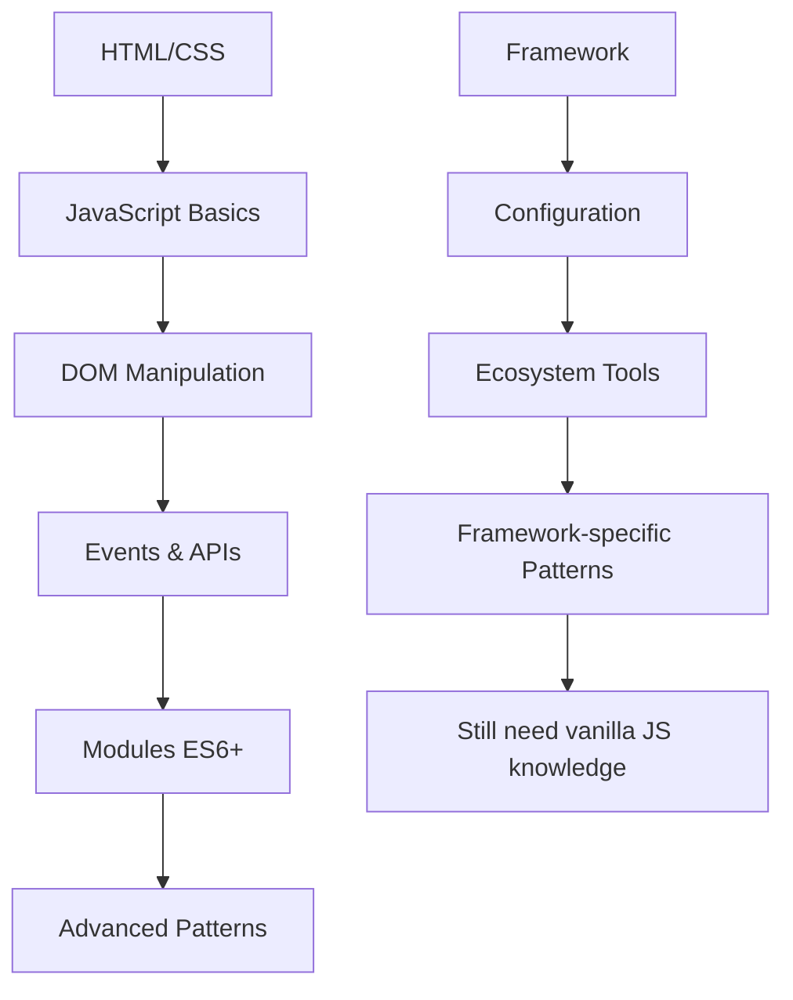

# JavaScript Vanilla vs Frameworks : Guide de décision pour développeurs en 2025

L'écosystème frontend moderne présente un paradoxe fascinant : alors que les frameworks JavaScript se multiplient et gagnent en sophistication, de plus en plus de développeurs expérimentés reviennent aux fondamentaux du **JavaScript vanilla**. Cette tendance n'est pas nostalgique, elle répond à des enjeux concrets de performance, maintenance et simplicité.

## Table des matières
- [L'état actuel de l'écosystème JavaScript](#état-écosystème)
- [Avantages du JavaScript vanilla](#avantages-vanilla)
- [Cas d'usage des frameworks](#cas-usage-frameworks)
- [Méthodologie de décision](#méthodologie-décision)
- [Exemples pratiques](#exemples-pratiques)
- [Recommandations d'expert](#recommandations)

## L'état actuel de l'écosystème JavaScript {#état-écosystème}

### Statistiques clés 2025

Selon le [State of JS 2024](https://stateofjs.com), l'écosystème se caractérise par :

- **React** : 67% d'adoption (stable)
- **Vue.js** : 46% d'adoption (+3% vs 2023)  
- **Angular** : 21% d'adoption (-2% vs 2023)
- **Vanilla JS** : Renaissance avec +15% d'intérêt

### La fatigue des frameworks

Un phénomène émergent touche l'industrie : la **framework fatigue**. Les développeurs rapportent :

- Complexité croissante des configurations
- Obsolescence rapide des dépendances  
- Courbe d'apprentissage en constante évolution
- Bundle sizes qui explosent (moyenne 2.3MB en 2025 vs 1.8MB en 2023)

## Avantages du JavaScript vanilla {#avantages-vanilla}

### 1. Performance native optimale

Le JavaScript natif offre des performances inégalées :

```javascript
// Exemple : Manipulation DOM directe
const button = document.querySelector('#submit-btn');
const counter = document.querySelector('#counter');
let count = 0;

// Performance : ~0.1ms par opération
button.addEventListener('click', () => {
  counter.textContent = ++count;
});

// vs React (overhead ~0.3-0.5ms par render)
// const [count, setCount] = useState(0);
// <button onClick={() => setCount(c => c + 1)}>{count}</button>
```

**Métriques comparatives** (tests Chrome DevTools) :

| Métrique | Vanilla JS | React | Vue.js | Angular |
|----------|------------|-------|--------|---------|
| **First Contentful Paint** | 0.8s | 1.2s | 1.1s | 1.4s |
| **Time to Interactive** | 1.1s | 2.3s | 2.0s | 2.8s |
| **Bundle Size (gzipped)** | 0KB | 42KB | 34KB | 130KB |

### 2. Maîtrise technique complète

Travailler en vanilla JavaScript développe :

- **Compréhension profonde** des APIs web natives
- **Debugging avancé** sans abstractions cachées
- **Optimisations sur mesure** pour votre contexte spécifique
- **Indépendance technologique** face aux évolutions d'écosystème

### 3. Maintenance et pérennité

```javascript
// Code vanilla JS écrit en 2015 - fonctionne toujours en 2025
document.addEventListener('DOMContentLoaded', function() {
  const nav = document.querySelector('.navigation');
  
  window.addEventListener('scroll', function() {
    if (window.scrollY > 100) {
      nav.classList.add('scrolled');
    } else {
      nav.classList.remove('scrolled');
    }
  });
});
```

**Avantages de stabilité** :

- ✅ **Rétrocompatibilité** : APIs web stables sur 10+ ans
- ✅ **Zéro dépendance** : pas de vulnérabilités tierces
- ✅ **Maintenance prévisible** : pas de migrations forcées

### 4. Courbe d'apprentissage progressive

Le vanilla JS suit une progression naturelle :



## Cas d'usage des frameworks {#cas-usage-frameworks}

### Quand les frameworks excellent

Les frameworks apportent une valeur réelle dans ces contextes :

#### 1. Applications complexes avec état partagé

```javascript
// Exemple : Dashboard avec multiples composants interconnectés
// React avec Context/Redux devient pertinent

const UserDashboard = () => {
  const { user, notifications, preferences } = useContext(AppContext);
  
  return (
    <div>
      <Header notifications={notifications} />
      <Sidebar preferences={preferences} />
      <MainContent user={user} />
      <ChatWidget notifications={notifications} />
    </div>
  );
};
```

#### 2. Équipes importantes (5+ développeurs)

- **Conventions partagées** : Architecture standardisée
- **Tooling mature** : Testing, debugging, dev tools
- **Écosystème riche** : Composants prêts, solutions éprouvées

#### 3. Développement rapide (MVP, prototypage)

```javascript
// Vue.js : Composant fonctionnel en 10 lignes
<template>
  <div class="user-card">
    
    <h3>{{ user.name }}</h3>
    <p>{{ user.role }}</p>
  </div>
</template>

<script setup>
defineProps(['user']);
</script>
```

## Méthodologie de décision {#méthodologie-décision}

### Matrice d'évaluation

Utilisez cette grille pour évaluer vos projets :

| Critère | Poids | Vanilla JS | Framework | Notes |
|---------|-------|------------|-----------|-------|
| **Complexité UI** | 25% | 1-5 | 6-10 | Nombre de composants interactifs |
| **Performance requise** | 20% | 8-10 | 4-7 | Core Web Vitals critiques ? |
| **Taille équipe** | 15% | 1-3 dev | 4+ dev | Conventions nécessaires ? |
| **Timeline** | 15% | +2 semaines | Standard | Temps de développement |
| **Maintenance prévue** | 15% | 5+ ans | 2-5 ans | Durée de vie du projet |
| **Expertise équipe** | 10% | JS avancé | Framework | Compétences disponibles |

**Calcul du score** :
- Vanilla JS recommandé si score ≥ 7/10
- Framework recommandé si score ≤ 5/10  
- Zone mixte : évaluation contextuelle

### Arbre de décision simplifié

```
Projet nécessite-t-il plus de 20 composants interactifs ?
├─ NON → Équipe > 5 développeurs ?
│  ├─ NON → Performance critique ?
│  │  ├─ OUI → VANILLA JS
│  │  └─ NON → VANILLA JS ou Framework léger
│  └─ OUI → Framework pour conventions
└─ OUI → Temps disponible > 4 semaines ?
   ├─ OUI → VANILLA JS possible
   └─ NON → Framework recommandé
```

## Exemples pratiques {#exemples-pratiques}

### Cas d'étude 1 : Composant Modal

**Besoin** : Modal réutilisable avec animations

#### Solution Vanilla JS

```javascript
class Modal {
  constructor(options = {}) {
    this.options = {
      closeOnOverlay: true,
      closeOnEscape: true,
      animation: 'fade',
      ...options
    };
    
    this.isOpen = false;
    this.element = this.createElement();
    this.bindEvents();
  }
  
  createElement() {
    const modal = document.createElement('div');
    modal.className = `modal modal--${this.options.animation}`;
    modal.innerHTML = `
      <div class="modal__overlay"></div>
      <div class="modal__content">
        <button class="modal__close" aria-label="Fermer">×</button>
        <div class="modal__body"></div>
      </div>
    `;
    
    document.body.appendChild(modal);
    return modal;
  }
  
  bindEvents() {
    const overlay = this.element.querySelector('.modal__overlay');
    const closeBtn = this.element.querySelector('.modal__close');
    
    if (this.options.closeOnOverlay) {
      overlay.addEventListener('click', () => this.close());
    }
    
    closeBtn.addEventListener('click', () => this.close());
    
    if (this.options.closeOnEscape) {
      document.addEventListener('keydown', (e) => {
        if (e.key === 'Escape' && this.isOpen) this.close();
      });
    }
  }
  
  open(content) {
    const body = this.element.querySelector('.modal__body');
    body.innerHTML = content;
    
    this.element.classList.add('modal--active');
    document.body.classList.add('modal-open');
    this.isOpen = true;
    
    // Focus management pour accessibilité
    this.element.querySelector('.modal__close').focus();
    
    return this;
  }
  
  close() {
    this.element.classList.remove('modal--active');
    document.body.classList.remove('modal-open');
    this.isOpen = false;
    
    return this;
  }
  
  destroy() {
    this.element.remove();
  }
}

// Usage
const modal = new Modal({ animation: 'slide' });
modal.open('<h2>Contenu de la modal</h2><p>Message important</p>');
```

**Avantages** : 2KB minifié, performance native, customisation totale

#### Solution React (comparaison)

```jsx
import { useState, useEffect, useRef } from 'react';
import { createPortal } from 'react-dom';

const Modal = ({ isOpen, onClose, children, closeOnOverlay = true }) => {
  const modalRef = useRef();
  
  useEffect(() => {
    const handleEscape = (e) => {
      if (e.key === 'Escape') onClose();
    };
    
    if (isOpen) {
      document.addEventListener('keydown', handleEscape);
      document.body.classList.add('modal-open');
      modalRef.current?.focus();
    }
    
    return () => {
      document.removeEventListener('keydown', handleEscape);
      document.body.classList.remove('modal-open');
    };
  }, [isOpen, onClose]);
  
  if (!isOpen) return null;
  
  return createPortal(
    <div className="modal modal--active">
      <div 
        className="modal__overlay"
        onClick={closeOnOverlay ? onClose : undefined}
      />
      <div className="modal__content" ref={modalRef} tabIndex={-1}>
        <button className="modal__close" onClick={onClose}>×</button>
        <div className="modal__body">{children}</div>
      </div>
    </div>,
    document.body
  );
};

// Usage
const App = () => {
  const [modalOpen, setModalOpen] = useState(false);
  
  return (
    <>
      <button onClick={() => setModalOpen(true)}>Ouvrir</button>
      <Modal isOpen={modalOpen} onClose={() => setModalOpen(false)}>
        <h2>Contenu de la modal</h2>
        <p>Message important</p>
      </Modal>
    </>
  );
};
```

**Coût** : +42KB (React), complexité state management, dépendances

### Cas d'étude 2 : Dashboard Analytics

**Besoin** : Interface complexe avec graphiques temps réel

Pour ce cas, un framework devient pertinent car :
- 15+ composants interconnectés
- État global complexe (utilisateurs, métriques, filtres)
- Équipe de 6 développeurs
- Updates temps réel via WebSocket

## Recommandations d'expert {#recommandations}

### Ma stratégie progressive (2025)

Après 8 ans d'expérience en développement frontend, voici ma méthode :

#### 1. **Commencez toujours par vanilla JS**

Posez-vous ces questions dans l'ordre :
- Puis-je résoudre ce problème en ≤ 200 lignes de JS natif ?
- La complexité justifie-t-elle l'overhead d'un framework ?
- Mon équipe maîtrise-t-elle les fondamentaux JS ?

#### 2. **Utilisez la règle des "3C"**

Un framework devient pertinent si vous avez au moins 2/3 :
- **Complexité** : +10 composants interactifs
- **Collaboration** : +3 développeurs  
- **Contrainte temps** : -50% temps vs vanilla

#### 3. **Évitez les frameworks par défaut**

❌ **Mauvaises raisons** :
- "C'est plus moderne"
- "Tout le monde l'utilise"  
- "Plus facile à recruter"
- "Ça fait bien sur le CV"

✅ **Bonnes raisons** :
- Résout un problème technique précis
- Apporte une valeur mesurable
- L'équipe maîtrise la technologie
- Long terme maintenance justifiée

#### 4. **Hybridation intelligente**

Combinez les approches selon les zones :

```javascript
// Architecture hybride
const App = {
  // Zone critique = Vanilla JS
  navigation: new NavigationController(),
  search: new SearchEngine(),
  
  // Zone complexe = Framework
  dashboard: new Vue({
    // Composants riches
  }),
  
  // Zone simple = Vanilla JS  
  footer: new SimpleComponents()
};
```

### Outils recommandés 2025

#### Vanilla JS moderne

```javascript
// Outils natifs puissants
import { html, render } from 'lit-html'; // Template engine léger
import { Router } from '@vaadin/router'; // Routing simple
import { signal } from '@preact/signals-core'; // State management

// Exemple stack vanilla moderne
const state = signal({ count: 0 });

const template = () => html`
  <button @click=${() => state.value = { count: state.value.count + 1 }}>
    Count: ${state.value.count}
  </button>
`;

render(template(), document.body);
```

#### Frameworks recommandés

- **React** : Écosystème mature, hiring facile
- **Vue.js** : Courbe apprentissage douce, DX excellent  
- **Svelte** : Compilé, performance native, syntaxe claire
- **Solid.js** : Performance maximale, concepts React

## Conclusion

En 2025, le choix entre JavaScript vanilla et frameworks ne doit plus être idéologique mais **pragmatique**. Le vanilla JS n'est ni obsolète ni systématiquement supérieur aux frameworks.

### Points clés à retenir

1. **Maîtrisez d'abord les fondamentaux** - Vanilla JS est votre socle
2. **Évaluez objectivement** - Utilisez des critères mesurables  
3. **Privilégiez la simplicité** - KISS reste une règle d'or
4. **Adaptez-vous au contexte** - Projet, équipe, contraintes
5. **Restez pragmatique** - Le meilleur outil résout efficacement le problème

### Ma recommandation finale

**Commencez par vanilla JavaScript**. Si vous ressentez une friction significative après 2-3 jours de développement, alors évaluez un framework. Cette approche vous garantit de choisir la technologie pour les bonnes raisons.

L'expertise ne consiste pas à connaître tous les frameworks, mais à **choisir l'outil adapté au problème**.

---

### Ressources complémentaires

- 📚 [You Don't Need jQuery](https://youdontneedjquery.com/)
- 🔧 [Vanilla JS Toolkit](https://vanillajstoolkit.com/)
- 📊 [Bundle Phobia](https://bundlephobia.com/) - Analyseur de poids des dépendances
- 🎯 [Web Platform APIs](https://developer.mozilla.org/en-US/docs/Web/API)

---

*Cet article reflète mon expérience de 8 ans en développement frontend. Pour discuter de votre architecture ou obtenir un audit technique, [contactez-moi](/contact). Découvrez d'autres analyses sur [le blog PeakCL](/blog).*

**Tags:** `#javascript` `#vanilla-js` `#frameworks` `#performance` `#architecture`